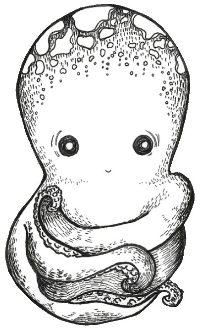

Drawing by [Moeka3](https://www.fiverr.com/moeka3)

# What is this badge?
I'm `booper.badge.lgbt`! Just a simple indie electronic badge for DEF CON 31.

At first, the team decided to take the year off of badge making, but then they got FOMO in mid-July, and made a last-minute badge. No prototypes, no testing, just YOLO. I hope you enjoy!

## How does it work?
Pretty simple! It just hangs out and looks cute, and also looks for its friends. The more of its friends it sees, the happier it gets, and the faster the lights above the eyes blink.

You can also boop the heart to make a cute face.

Press and hold the heart to adjust the LED brightness.

# Is this a queercon badge?
No. The `badge.lgbt` team also works on badges for Queercon, but this one's not officially related to Queercon at all. It's our own project!

# Weren't you going to make more floppies?
Yeah, and we really are still planning to make another batch and issue a code update. We've actually fixed a few bugs in the main `badge.lgbt` repo since shipping for 2021. But parts availability for some critical components have been very, very bad the last two years. We hope to bring it back for 2024. Wish us luck...
